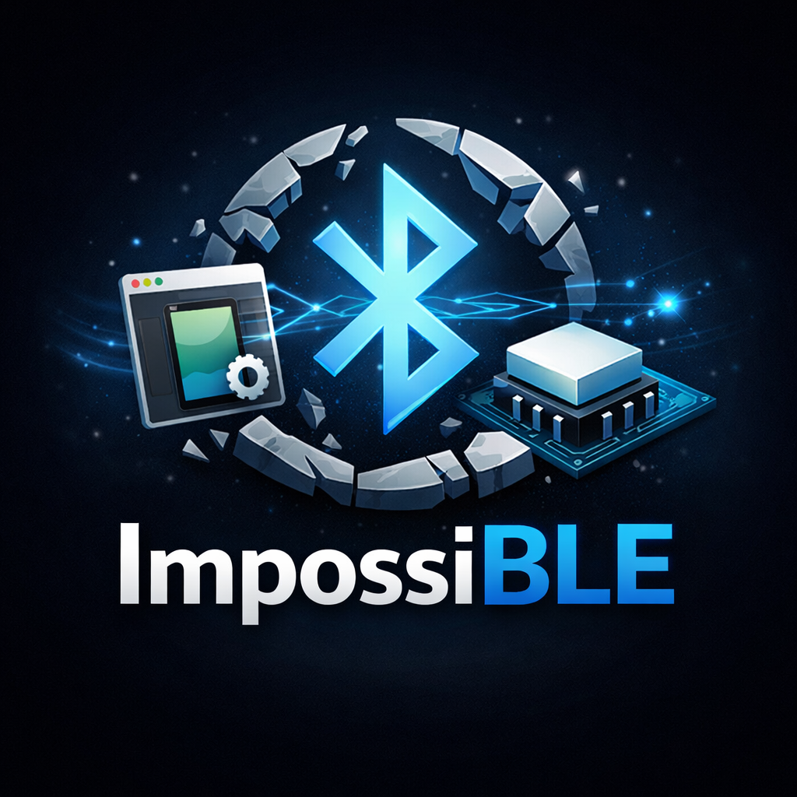

<p align="center">
  
</p>

# ImpossiBLE

**Use real Bluetooth Low Energy hardware from the iOS Simulator.**

Apple's `CoreBluetooth` framework does not function inside the iOS Simulator -- peripherals cannot be discovered, connections fail silently, and the `CBCentralManager` state never reaches `poweredOn`. ImpossiBLE makes the impossible possible by transparently bridging BLE operations from your simulated app to actual Bluetooth hardware on the host Mac.

## Simulator Reality (and Why This Exists)

Older iOS Simulator builds exposed *some* CoreBluetooth behavior, but it was incomplete and eventually fell out of maintenance. Apple has long recommended that developers test Bluetooth flows on real devices, and that recommendation still stands. ImpossiBLE is not a replacement for on-device testing -- it is a convenience layer so you can iterate faster between device runs.

## How It Works

ImpossiBLE is a two-process architecture:

1. **Library** (linked into your iOS app) -- Uses Objective-C runtime swizzling to intercept all `CBCentralManager` calls at load time. Instead of talking to the (non-functional) simulated Bluetooth stack, it forwards every operation as JSON messages over a Unix domain socket.

2. **Helper** (runs natively on macOS) -- A lightweight background app that listens on `/tmp/impossible.sock`, translates the JSON messages into real `CoreBluetooth` API calls, and sends results back.

Your app code remains unchanged -- `CBCentralManager`, `CBPeripheral`, delegate callbacks, and all other CoreBluetooth types work as expected.

### Under the Hood (Technical Details)

- **Method swizzling on the simulator**: the library swizzles `CBCentralManager` init/state/scan/connect APIs and routes them to a local transport.
- **Proxy CoreBluetooth objects**: it creates shim `CBPeripheral`, `CBService`, `CBCharacteristic`, and `CBL2CAPChannel` objects so your app sees real types.
- **Transport**: newline-delimited JSON over a Unix domain socket (`/tmp/impossible.sock`).
- **Data encoding**: characteristic values and L2CAP payloads are base64-encoded across the wire.
- **Callback fidelity**: delegate callbacks are dispatched back onto the original `CBCentralManager` delegate queue.

## Features

- Scan for peripherals with service filters
- Connect and disconnect
- Discover services and characteristics
- Read, write (with/without response), and notify
- L2CAP channel support
- Automatic `+load` activation -- no setup code required

## Requirements

- macOS with Bluetooth hardware
- Xcode 15+ (Swift Package Manager)
- Codesigning certificate recommended (optional). If none matches `CODESIGN_MATCH`, the helper builds unsigned with a warning.
- `fswatch` (optional, for `make watch` auto-rebuild)

## Quick Start

```bash
# Clone and build the helper
cd ImpossiBLE
make install

# Start the helper (runs as a background app)
make run

# In Xcode: add ImpossiBLE as a local Swift package dependency,
# then build and run your app in the iOS Simulator.
```

## Makefile Targets

| Target    | Description                                        |
|-----------|----------------------------------------------------|
| `helper`  | Build the helper `.app` bundle                     |
| `install` | Build and copy to `~/.local/bin/`                  |
| `run`     | Install and start (if not already running)         |
| `restart` | Install, kill existing helper, and relaunch         |
| `watch`   | Install, start, and auto-rebuild on source changes |
| `clean`   | Remove local build artifacts                       |

## Integration

Add ImpossiBLE as a **local Swift package** in your Xcode project pointing to the cloned directory. Then import it:

```swift
import ImpossiBLE
```

That is all. The library activates automatically via `+load` on simulator builds. On device builds, all ImpossiBLE code compiles to no-ops.

## Limitations

- **Central role only** -- peripheral/broadcaster mode is not supported.
- **Single client** -- only one simulator app can connect to the helper at a time.
- **Helper must be running** -- start it before launching your app in the simulator.

## Roadmap to 1.0 (Goal: 100% CoreBluetooth Coverage)

The goal is full CoreBluetooth API coverage in the simulator. Real-device testing is still required, but this tracks what remains before a 1.0 release:

- [ ] **Peripheral role support** (advertising, GATT server, write/notify from the peripheral side).
- [ ] **Multiple simulator clients** (concurrent apps connecting to the helper).
- [ ] **Full descriptor support** (discover/read/write descriptors beyond characteristics).
- [ ] **Improved state/authorization fidelity** (authorization states, feature gating, and error codes matching device behavior).
- [ ] **State restoration parity** (`CBCentralManager` restoration flows).
- [ ] **Pairing / security flows** (bonding, encryption-required characteristics, and relevant errors).
- [ ] **Performance + robustness** (larger payloads, stress testing, graceful reconnects, helper auto-restart).

## License

MIT -- see [LICENSE](LICENSE) for details.
