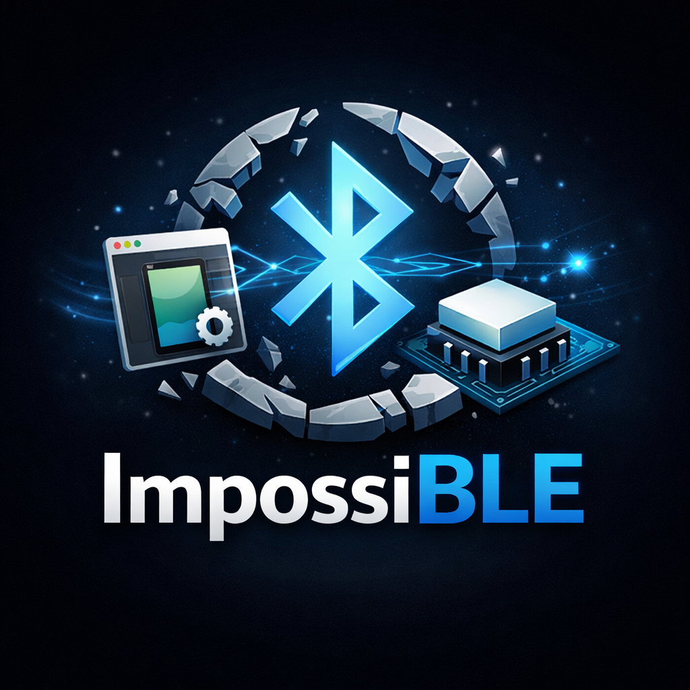

<p align="center">
  
</p>

# ImpossiBLE

**Use real Bluetooth Low Energy hardware from the iOS Simulator.**

Apple's `CoreBluetooth` framework does not function inside the iOS Simulator -- peripherals cannot be discovered, connections fail silently, and the `CBCentralManager` state never reaches `poweredOn`. ImpossiBLE makes the impossible possible by transparently bridging BLE operations from your simulated app to actual Bluetooth hardware on the host Mac.

## Simulator Reality (and Why This Exists)

Older iOS Simulator builds exposed *some* CoreBluetooth behavior, but it was incomplete and eventually fell out of maintenance. Apple has long recommended that developers test Bluetooth flows on real devices, and that recommendation still stands. ImpossiBLE is not a replacement for on-device testing -- it is a convenience layer so you can iterate faster between device runs.

## How It Works

ImpossiBLE is a two-process architecture:

1. **Library** (linked into your iOS app) -- Uses Objective-C runtime swizzling to intercept all `CBCentralManager` calls at load time. Instead of talking to the (non-functional) simulated Bluetooth stack, it forwards every operation as JSON messages over a Unix domain socket.

2. **Helper** (runs natively on macOS) -- A lightweight background app that listens on `/tmp/impossible.sock`, translates the JSON messages into real `CoreBluetooth` API calls, and sends results back.

The repo also includes a **mock menu bar app** that listens on the same socket and serves configurable virtual BLE peripherals. The menu bar icon (Bluetooth logo via FontAwesome) flashes on socket traffic so you can see activity at a glance. The mock app ships with several stock configurations -- from a single heart rate monitor to a dense 12-device sensor environment -- and lets you save/load your own. Server state is persisted and auto-restored on launch. Use either the real helper or the mock app at one time, since both own `/tmp/impossible.sock`.

Your app code remains unchanged -- `CBCentralManager`, `CBPeripheral`, delegate callbacks, and all other CoreBluetooth types work as expected.

### Under the Hood (Technical Details)

- **Method swizzling on the simulator**: the library swizzles `CBCentralManager` init/state/scan/connect APIs and routes them to a local transport.
- **Multi-central multiplexing**: multiple `CBCentralManager` instances in the same app work independently, each with its own peripheral store, scan filters, and delegate callbacks -- matching real CoreBluetooth behavior where peripherals and their discovered services are shared across managers.
- **Proxy CoreBluetooth objects**: it creates shim `CBPeripheral`, `CBService`, `CBCharacteristic`, `CBDescriptor`, and `CBL2CAPChannel` objects so your app sees real types.
- **Transport**: newline-delimited JSON over a Unix domain socket (`/tmp/impossible.sock`), with auto-reconnect.
- **Connection-aware state**: `CBCentralManager.state` reflects actual socket connectivity -- `poweredOn` when connected to a provider, `poweredOff` when not. `centralManagerDidUpdateState:` fires automatically on transitions, so your app reacts to the helper/mock starting or stopping just like it would to real Bluetooth state changes.
- **Data encoding**: characteristic values and L2CAP payloads are base64-encoded across the wire.
- **Service filter fidelity**: the helper enforces `discoverServices:` filters to match iOS behavior, even though macOS CoreBluetooth returns all cached services.
- **Callback fidelity**: delegate callbacks are dispatched back onto the original `CBCentralManager` delegate queue.

## Features

- Multiple `CBCentralManager` instances with independent scan/connect lifecycles
- Scan for peripherals with service filters
- Connect and disconnect
- Discover services, characteristics, and descriptors
- Read, write (with/without response), and notify
- L2CAP channel support (with timeout handling)
- Connection-aware `CBManagerState` with automatic `centralManagerDidUpdateState:` callbacks
- Auto-reconnect when the provider starts after the app
- Automatic `+load` activation -- no setup code required

## Requirements

- macOS with Bluetooth hardware
- Xcode 15+ (Swift Package Manager)
- Codesigning certificate recommended (optional). If none matches `CODESIGN_MATCH`, the helper builds unsigned with a warning.
- `fswatch` (optional, for `make watch` auto-rebuild)

## Quick Start

```bash
# Clone and build the helper
cd ImpossiBLE
make install

# Start the helper (runs as a background app)
make run

# In Xcode: add ImpossiBLE as a local Swift package dependency,
# then build and run your app in the iOS Simulator.
```

## Forwarding vs Mocking

The iOS app always uses the same ImpossiBLE integration and connects to `/tmp/impossible.sock`. Switching modes is done by choosing which macOS app owns that socket:

```bash
# Forwarding mode: simulator app -> real Mac Bluetooth hardware
make mock-stop
make run
```

```bash
# Mocking mode: simulator app -> virtual BLE devices from the menu bar app
make stop
make mock-run
```

Run only one provider at a time. The background helper and the mock menu bar app are mutually exclusive because both listen on `/tmp/impossible.sock`.

## Makefile Targets

| Target    | Description                                        |
|-----------|----------------------------------------------------|
| `helper`  | Build the helper `.app` bundle                     |
| `install` | Build and copy to `~/.local/bin/`                  |
| `run`     | Install and start (if not already running)         |
| `restart` | Install, kill existing helper, and relaunch         |
| `watch`   | Install, start, and auto-rebuild on source changes |
| `mock`    | Build the mock menu bar `.app` bundle              |
| `mock-run`| Install and start the mock menu bar app            |
| `mock-assess` | Verify signing and Gatekeeper assessment      |
| `mock-notarize` | Notarize and staple the mock menu bar app   |
| `clean`   | Remove local build artifacts                       |

For local development, the mock app falls back to ad-hoc signing if no identity matches `MOCK_CODESIGN_MATCH`. Gatekeeper will reject ad-hoc signed copies that are quarantined or distributed. For a distributable mock app, build with a Developer ID Application certificate, for example:

```bash
make mock MOCK_CODESIGN_MATCH="Developer ID Application"
make mock-notarize NOTARY_PROFILE="impossible-notary"
```

## Integration

Add ImpossiBLE as a **local Swift package** in your Xcode project pointing to the cloned directory. Then import it:

```swift
import ImpossiBLE
```

That is all. The library activates automatically via `+load` on simulator builds. On device builds, all ImpossiBLE code compiles to no-ops.

## Limitations

- **Central role only** -- peripheral/broadcaster mode is not supported.
- **Single simulator app** -- only one simulator app can connect to the helper at a time. A new client connection replaces the existing one; the previous client is dropped and the helper tears down scans, connections, and L2CAP channels. Multiple `CBCentralManager` instances within a single app are fully supported.
- **Provider must be running** -- the library auto-reconnects every 2 seconds, so you can start the helper or mock app before or after your simulator app. Until connected, `CBCentralManager.state` reports `poweredOff`.

## Roadmap to 1.0 (Goal: 100% CoreBluetooth Coverage)

The goal is full CoreBluetooth API coverage in the simulator. Real-device testing is still required, but this tracks what remains before a 1.0 release:

- [ ] **Peripheral role support** (advertising, GATT server, write/notify from the peripheral side).
- [ ] **Multiple simulator clients** (concurrent apps connecting to the helper).
- [x] **Full descriptor support** (discover/read/write descriptors beyond characteristics).
- [ ] **Improved state/authorization fidelity** (authorization states, feature gating, and error codes matching device behavior). `CBManagerState` now tracks socket connectivity; remaining work is authorization edge cases.
- [ ] **State restoration parity** (`CBCentralManager` restoration flows).
- [ ] **Pairing / security flows** (bonding, encryption-required characteristics, and relevant errors).
- [ ] **Performance + robustness** (larger payloads, stress testing). Auto-reconnect is now implemented.
- [x] **Configurable mocking schemes** — the mock menu bar app provides stock and user-defined device configurations with full control over services, characteristics, descriptors, and server availability. Remaining work: scripted fault injection and programmatic test automation.

## License

MIT -- see [LICENSE](LICENSE) for details.
