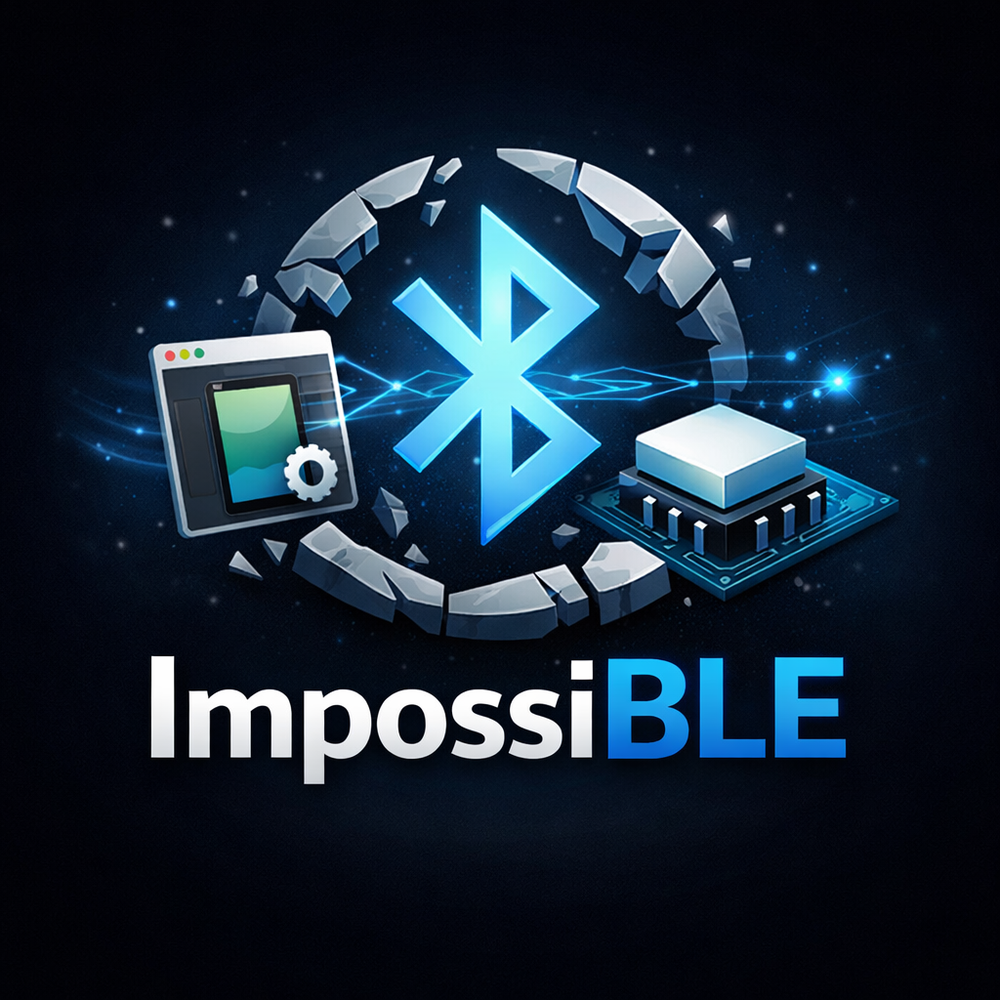
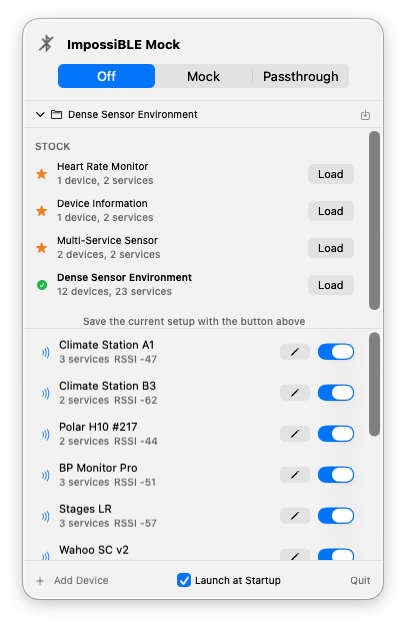
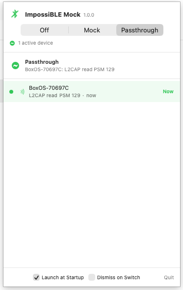
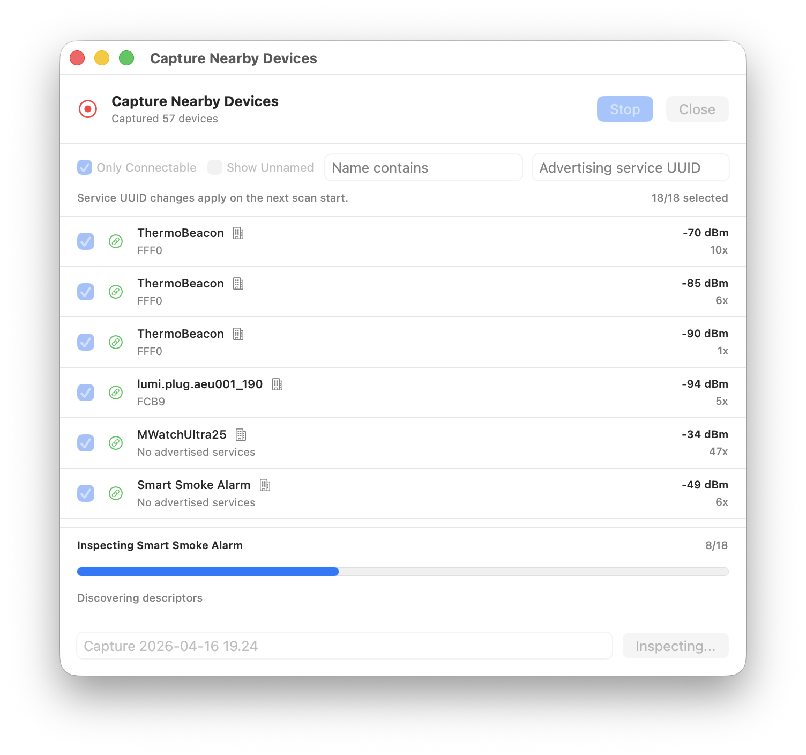

<p align="center">
  
</p>

# ImpossiBLE

**Use real Bluetooth Low Energy hardware from the iOS Simulator.**

Apple's `CoreBluetooth` framework does not function inside the iOS Simulator — peripherals cannot be discovered, connections fail silently, and the `CBCentralManager` state never reaches `poweredOn`. ImpossiBLE makes the impossible possible by transparently bridging BLE operations from your simulated app to actual Bluetooth hardware on the host Mac.

## Simulator Reality (and Why This Exists)

Older iOS Simulator builds exposed *some* CoreBluetooth behavior, but it was incomplete and eventually fell out of maintenance. Apple has long recommended that developers test Bluetooth flows on real devices, and that recommendation still stands. ImpossiBLE is not a replacement for on-device testing — it is a convenience layer so you can iterate faster between device runs.

## How It Works

ImpossiBLE is a two-process architecture:

1. **Library** (linked into your iOS app) — Uses Objective-C runtime swizzling to intercept all `CBCentralManager` calls at load time. Instead of talking to the (non-functional) simulated Bluetooth stack, it forwards every operation as JSON messages over a Unix domain socket.

2. **Mock menu bar app** (runs natively on macOS) — The single provider owning `/tmp/impossible.sock`. In **Mock** mode it serves configurable virtual BLE peripherals; in **Passthrough** mode it translates the same messages into real `CoreBluetooth` API calls against the Mac's Bluetooth hardware — both in one process, switched by a segmented **Off / Mock / Passthrough** control.

The custom menu bar window stays open while you switch apps, or can be set to dismiss on app switch from the footer. The menu bar icon reflects the active mode (strikethrough when off, plain when forwarding, dot-badged when mocking) and flashes on mock or Passthrough traffic so you can see activity at a glance. In Passthrough mode, the app lists only devices your simulator app actually communicates with through GATT or L2CAP operations, not devices that were merely discovered while scanning. The Mac app ships with several stock configurations — from a single heart rate monitor to a dense 12-device sensor environment — and lets you save/load your own. It can also capture nearby BLE advertisements into a new mock configuration; the factory icon in capture results means that advertisement includes manufacturer-specific data. A "Launch at Startup" option in the footer installs a LaunchAgent for automatic login startup. Server state is persisted and auto-restored on launch.

Your app code remains unchanged — `CBCentralManager`, `CBPeripheral`, delegate callbacks, and all other CoreBluetooth types work as expected.

An app can also **bring its own mock configuration** instead of relying on the menu bar selection; see [Client-Supplied Configurations](#client-supplied-configurations) below.

<p align="center">
  
  &nbsp;&nbsp;
  
</p>

### Under the Hood (Technical Details)

- **Method swizzling on the simulator**: the library swizzles `CBCentralManager` init/state/scan/connect APIs at `+load` and routes them to a local transport. The socket connection to the provider is opened lazily on the first `CBCentralManager` instantiation, so apps that link ImpossiBLE without using CoreBluetooth do not contact the provider.
- **Multi-central multiplexing**: multiple `CBCentralManager` instances in the same app work independently, each with its own peripheral store, scan filters, and delegate callbacks — matching real CoreBluetooth behavior where peripherals and their discovered services are shared across managers.
- **Proxy CoreBluetooth objects**: it creates shim `CBPeripheral`, `CBService`, `CBCharacteristic`, `CBDescriptor`, and `CBL2CAPChannel` objects so your app sees real types.
- **Transport**: newline-delimited JSON over a Unix domain socket (`/tmp/impossible.sock`), with auto-reconnect.
- **Connection-aware state**: `CBCentralManager.state` reflects actual socket connectivity — `poweredOn` when connected to a provider, `poweredOff` when not. `centralManagerDidUpdateState:` fires automatically on transitions, so your app reacts to the provider starting or stopping just like it would to real Bluetooth state changes. If the provider connection drops while peripherals are connected, the library also delivers `centralManager:didDisconnectPeripheral:` for each and closes any open L2CAP channels, so your disconnect handling runs instead of leaving a stale connection.
- **Data encoding**: characteristic values and L2CAP payloads are base64-encoded across the wire.
- **Service filter fidelity**: Passthrough enforces `discoverServices:` filters to match iOS behavior, even though macOS CoreBluetooth returns all cached services.
- **Version handshake**: the library introduces itself with a `hello` message (library version, bundle id, pid), so the panel can show which app and library version is connected and version skew is diagnosable instead of silent.
- **Callback fidelity**: delegate callbacks are dispatched back onto the original `CBCentralManager` delegate queue.

## Features

- Multiple `CBCentralManager` instances with independent scan/connect lifecycles
- Scan for peripherals with service filters
- Connect and disconnect
- Discover services, characteristics, and descriptors
- Read, write (with/without response), and notify
- L2CAP channel support (with timeout handling)
- Passthrough device activity list for actual GATT/L2CAP communication
- Persistent menu bar control panel with optional dismiss-on-app-switch behavior
- Connection-aware `CBManagerState` with automatic `centralManagerDidUpdateState:` callbacks
- Auto-reconnect when the provider starts after the app
- Automatic activation — no setup code required; the provider connection is opened lazily on the first `CBCentralManager` instantiation
- Client-supplied mock configurations, so tests can carry their own virtual peripherals

## Requirements

- macOS with Bluetooth hardware
- Xcode 15+ (Swift Package Manager)
- Codesigning certificate recommended (optional). If none matches `MAC_CODESIGN_MATCH`, the Mac app is signed ad hoc with a warning. Note that Passthrough mode needs the Bluetooth entitlement under the Hardened Runtime, so a properly signed build is required for distributed copies.

## Quick Start

```bash
# Clone, build, and start the Mac menu bar app
cd ImpossiBLE
make mac-run

# Select "Mock" or "Passthrough" in its panel.

# In Xcode: add ImpossiBLE as a local Swift package dependency,
# then build and run your app in the iOS Simulator.
```

## Client-Supplied Configurations

Mock mode normally serves whatever configuration is selected in the menu bar app. That is convenient for exploring, but awkward for tests: the fixture lives somewhere else, and it silently goes stale. It breaks entirely when the service UUIDs under test are *computed* at runtime rather than fixed — a saved configuration then describes the wrong device and the test just sees an empty scan.

So an app can upload its own configuration:

```swift
import ImpossiBLE

let configuration: Data = try JSONEncoder().encode(myFixture)
if ImpossiBLESetMockConfiguration(configuration) {
    // The mock now serves these devices instead of the menu bar selection.
}
```

The payload has the same shape as a saved configuration file, so an exported configuration can be handed over verbatim:

```json
{
  "id": "…",
  "name": "Two peers and a stranger",
  "devices": [ { "id": "…", "name": "…", "advertisedServiceUUIDs": ["…"], "services": [ … ] } ]
}
```

Three properties are worth knowing:

- **Ephemeral.** The uploaded configuration is held in memory by the provider. It is never written to your saved configurations, and it is discarded when the app disconnects or another app connects. Your own selection resumes automatically.
- **Visible.** While a client configuration is active the menu bar panel shows it in place of the selection — which app supplied it, its name, and a read-only list of the devices actually being served.
- **Verified.** The provider acknowledges with `didSetMockConfiguration`, reporting a decoding failure rather than leaving a malformed fixture to look like an empty environment.

`ImpossiBLEIsProviderConnected()` waits briefly for the socket, so it is safe to call at start-up before any `CBCentralManager` exists. On device builds every function is a no-op returning `NO`, so the same code can run in both places and simply use the real radio.

### L2CAP Against Yourself

A mock provider cannot answer an L2CAP channel: nothing on its side knows what bytes your protocol expects. Only your app does. So rather than inventing a peer, ImpossiBLE hands your app the *other end* of the channel:

```swift
ImpossiBLESetMockL2CAPHandler { psm, input, output in
    // The peer end. Speak your own protocol back at yourself.
}
```

`openL2CAPChannel` is then served in process — a `socketpair` backs the channel, your app gets one end as a normal `CBL2CAPChannel`, the handler gets the other as an already-open stream pair. The provider is not involved, so the loop runs at memory speed.

This matters most for apps whose peripheral role cannot run in the Simulator at all: `CBPeripheralManager` is unavailable there, but the *framing* on both sides is usually the same code. Playing both roles exercises encode → wire → decode against real CoreBluetooth objects.

The handler applies only while a client-supplied configuration is active. In Passthrough mode the real channel is used and a registered handler is ignored, so a loopback can never quietly shadow the hardware you switched to.

### Limitations

Pin the provider alongside the library: a client built against 2.4.0 talking to an older provider has its upload ignored as an unknown message type and then scans against whatever that provider happens to serve. Since 3.0.0 the library reports its version on connect and the panel shows it next to the connected client, so a mismatch is visible instead of silent.

## Forwarding vs Mocking

The iOS app always uses the same ImpossiBLE integration and connects to `/tmp/impossible.sock`. The Mac menu bar app is the single provider owning that socket; the segmented **Off / Mock / Passthrough** picker selects what it serves. In Passthrough mode it also shows the real BLE devices that have seen actual read/write/subscribe/L2CAP traffic, with a short active indicator for current communication.

Passthrough uses macOS Bluetooth directly from the Mac app, so the first activation prompts for Bluetooth permission. Ad-hoc signed development builds get a fresh signing identity on each rebuild, which makes macOS re-prompt.

For headless setups, the app's state can be seeded before launch instead of clicking the panel:

```bash
defaults write com.impossible.ble-mac SelectedProviderMode passthrough   # or: mock / off
make mac-run
```

### Capturing Mock Configurations

<p align="center">
  
</p>

The Mac menu bar app can capture nearby BLE devices into a new editable configuration. Click **Capture**, start scanning, choose the devices to include, then save the configuration.

Capture results hide unnamed devices by default and sort likely useful devices first: advertisements with more service UUIDs, named devices, connectable devices, manufacturer-specific data, then stronger RSSI. Enable **Show Unnamed** when you need to inspect the full noisy environment. The factory icon means the advertisement includes manufacturer-specific data.

When you save a capture, ImpossiBLE performs a deeper inspection for selected connectable devices before writing the configuration. It connects to each device, discovers services, characteristics, and descriptors, and reads values where CoreBluetooth allows reads. Devices that are not connectable, fail to connect, or time out are still saved from their advertisement data. Secured characteristics may fail or trigger normal pairing/security behavior from macOS.

## Makefile Targets

| Target    | Description                                        |
|-----------|----------------------------------------------------|
| `mac`    | Build the Mac menu bar `.app` bundle              |
| `install` | Build and copy to `~/.local/bin/`                  |
| `mac-relaunch` | Rebuild a debug Mac app bundle and relaunch from the repo |
| `mac-run`| Install and start the Mac menu bar app            |
| `mac-stop` | Stop the running Mac menu bar app               |
| `mac-status` | Show whether the Mac app is running           |
| `mac-log` | Tail system log output from the Mac app          |
| `mac-assess` | Verify signing and Gatekeeper assessment       |
| `mac-notarize` | Notarize and staple the Mac menu bar app    |
| `clean`   | Remove local build artifacts                       |

For local development, the Mac app falls back to ad-hoc signing if no identity matches `MAC_CODESIGN_MATCH`. Gatekeeper will reject ad-hoc signed copies that are quarantined or distributed. For a distributable Mac app, build with a Developer ID Application certificate, for example:

```bash
make mac MAC_CODESIGN_MATCH="Developer ID Application"
make mac-notarize NOTARY_PROFILE="impossible-notary"
```

## Integration

Add ImpossiBLE as a **local Swift package** in your Xcode project pointing to the cloned directory. Then import it:

```swift
import ImpossiBLE
```

That is all. On simulator builds the library installs its CoreBluetooth swizzles at `+load`; the provider socket is opened on demand when your app instantiates its first `CBCentralManager`. On device builds, all ImpossiBLE code compiles to no-ops.

## Limitations

- **Central role only** — peripheral/broadcaster mode is not supported.
- **Single simulator app, last connection wins** — the provider serves one simulator app at a time, and a new connection *takes over*: the previous client is disconnected (its library stops auto-reconnecting, its scans, connections, and L2CAP channels are torn down) and the freshly launched app is served. This is what makes relaunching the app, or switching between simulators, "just work" — to use an older simulator again, relaunch its app. Multiple `CBCentralManager` instances within a single app are fully supported.
- **Provider must be running** — the library auto-reconnects every 2 seconds, so you can start the Mac app before or after your simulator app. Until connected, `CBCentralManager.state` reports `poweredOff`.

## Roadmap Beyond 2.0

The goal remains full CoreBluetooth API coverage in the simulator. Real-device testing is still required, but this tracks what remains after the 2.0 release:

- [ ] **Peripheral role support** (advertising, GATT server, write/notify from the peripheral side).
- [ ] **Multiple simulator clients** (concurrent apps connecting to the provider).
- [x] **Full descriptor support** (discover/read/write descriptors beyond characteristics).
- [ ] **Improved state/authorization fidelity** (authorization states, feature gating, and error codes matching device behavior). `CBManagerState` now tracks socket connectivity; remaining work is authorization edge cases.
- [ ] **State restoration parity** (`CBCentralManager` restoration flows).
- [x] **Pairing / security flows** (bonding, encryption-required characteristics, and relevant errors) in mock mode. Remaining work: passthrough parity for every macOS pairing edge case.
- [ ] **Performance + robustness** (larger payloads, stress testing). Auto-reconnect and Passthrough activity visibility are now implemented.
- [x] **Configurable mocking schemes** — the Mac menu bar app provides stock and user-defined device configurations with full control over services, characteristics, descriptors, and server availability. Remaining work: scripted fault injection and programmatic test automation.

## License

MIT — see [LICENSE](LICENSE) for details.
